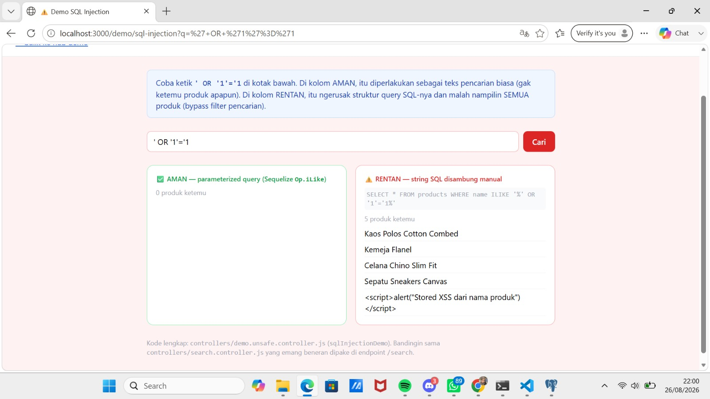
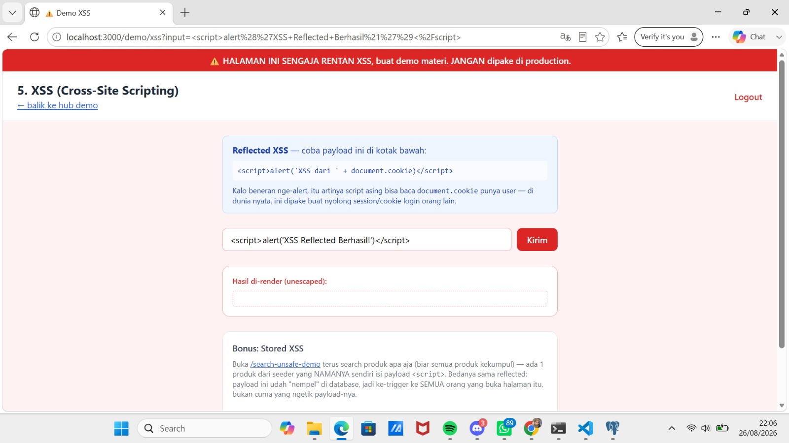
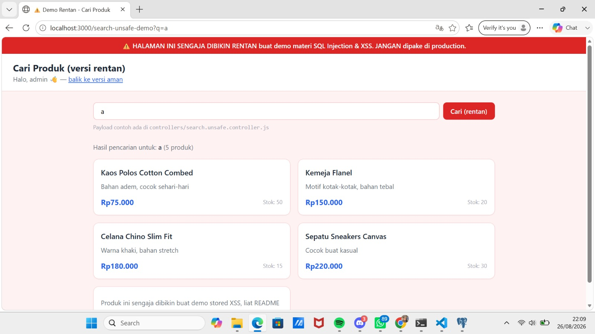

# Laporan Tugas Week 12 - Keamanan Web
**Nama:** Miranti
**Topik:** Eksplorasi Kerentanan & Implementasi Form Aman

---

## Bagian 1: Eksplorasi (Bukti Kerentanan)

### 1. SQL Injection

* **Penjelasan:** Payload `' OR '1'='1` berhasil menembus pencarian karena input pengguna langsung disambungkan (concatenate) secara manual ke dalam *raw string query* SQL tanpa menggunakan *parameterized query*. Hal ini memanipulasi logika `WHERE` menjadi selalu `TRUE` sehingga seluruh data produk terekspos.

### 2. XSS Reflected

* **Penjelasan:** Payload `<script>alert(...)</script>` tereksekusi oleh browser karena data input dari URL/parameter langsung dirender kembali ke halaman web tanpa melalui proses *escape* atau *encoding* entitas HTML terlebih dahulu.

### 3. XSS Stored

* **Penjelasan:** Script berbahaya yang disisipkan ke dalam nama produk (dari *seeder*) berhasil tersimpan di database dan otomatis tereksekusi pada browser korban setiap kali halaman tersebut diakses, karena saat render menggunakan sintaks raw EJS `<%- %>`.

### 4. Escape HTML
c:\Users\ASUS\AppData\Local\Packages\5319275A.WhatsAppDesktop_cv1g1gvanyjgm\LocalState\sessions\33DB9178635840D5E55B2854DC8AF80C2EF0CE46\transfers\2026-35\WhatsApp Image 2026-08-26 at 22.05.20.jpeg
* **Penjelasan:** Input berupa tag `` berhasil mengubah struktur DOM karena aplikasi gagal mengubah karakter khusus HTML (`<` dan `>`) menjadi entitas yang aman. Halaman merender tag tersebut apa adanya, memicu *error* gambar dan mengeksekusi *alert*.

---

## Bagian 2: Implementasi Mandiri (Form Komentar Aman)

### 1. Validasi Server-Side

* **Keterangan:** Gambar di atas menunjukkan validasi di sisi server (Node.js/Controller) yang secara aktif menolak data saat pengguna mencoba mengirimkan *form* kosong, dengan menampilkan pesan error yang jelas, bukan sekadar mengandalkan atribut `required` di sisi klien (HTML).

### 2. Sanitasi Input
Berikut adalah kode yang digunakan untuk membersihkan *input* pengguna sebelum diproses lebih lanjut:
```javascript
// Sanitasi: Menghapus spasi berlebih (trim) di awal dan akhir input untuk mencegah data kosong yang terselubung
const nama = req.body.nama ? req.body.nama.trim() : '';
const komentar = req.body.komentar ? req.body.komentar.trim() : '';